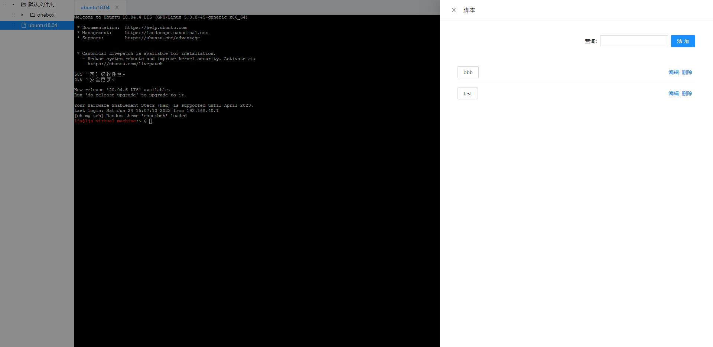
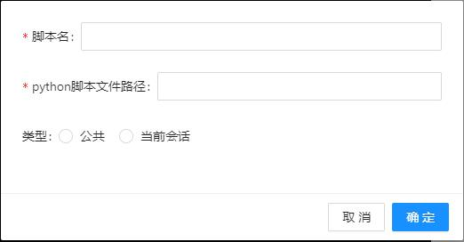
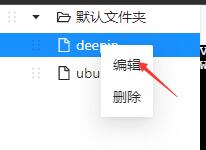
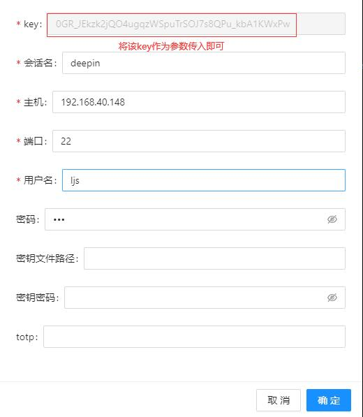

# WebShell

该项目不再维护,感兴趣可以关注我的另一个项目: https://github.com/koleter/elecshell

### Introduction

用作 ssh 客户端以连接到 ssh 服务器的一个 Web 应用程序

在以往的工作中接触到了很多的ssh客户端工具如finalShell,xshell,MobaxTerm等,其中xshell的脚本功能在某些情况下节省了我不少的时间,但是xshell的脚本可以做的事情也比较有限,存在以下问题:
1. 使用不便,比如想要使用一个非系统模块requests去发送一个网络请求,首先就要先安装该模块,xshell的python是自带的,并不是用户自己安装的python,故无法实现该操作且百度无果,没有找到好的解决方案
2. 可以创建新的会话,但是创建出来的会话用户不可控,你无法在脚本中向新创建的会话发送某些命令
3. 可以发送命令但是无法接收命令执行后的返回结果(该项目可以做到这一点,但是获取的结果会有些奇怪)

该项目使用了tornado,websocket,antd,xterm

## Preview


## script
鼠标移动到窗口的最右侧可弹出脚本窗口


点击添加按钮显示如下界面



脚本名是显示在界面上的按钮名字,python文件路径为一个python文件的绝对路径,
一个脚本按钮的类型分为两种,公共表示所有的会话都可以使用该按钮,当前会话表示只有当前的会话可以使用的按钮(其他的会话处于活跃状态时无法看到该按钮)

python脚本的入口为Main函数,接受一个形参,该参数为handler.pojo.SessionContext.SessionContext类的一个实例对象,
可以认为是代表了当前会话的一个对象,可用的接口可以参考该类的定义


handler.pojo.SessionContext.SessionContext类中有两个函数需要回调函数,一个是用于接收用户输入的prompt,另一个是用来创建新会话的create_new_session函数,
回调函数需要至少两个参数,第一个参数代表当前会话的上下文对象,第二个参数为回调的结果,其余的参数为客户自行传入的参数

```python
def prompt_callback(ctx, result, my_arg):
    print("自行传入的参数为: {}".format(my_arg))
    if not result:
        return
    print(f'用户的输入为{result}')
    ctx.send(result + '\r')


def Main(ctx):
    ctx.prompt("请输入要执行的命令:", prompt_callback, 4)
```

```python
def callback(ctx, created_ctxs, a, b):
    print("自定义参数相加结果: {}".format(a + b))
    cmds = ['pwd\r', 'ls /\r', 'ls\r']
    for i in range(len(created_ctxs)):
        ret = created_ctxs[i].on_recv(cmds[i % len(cmds)])
        if "dev" in ret:
            created_ctxs[i].send('pwd\r')


def Main(ctx):
    ctx.create_new_session([ctx.get_xsh_conf_id()]*2, callback, 3, 4)
```
该脚本相当于复制了当前会话2次,并在新的会话中分别执行了"pwd"与"ls /"命令,其中如果某个会话执行的命令的返回结果中有dev这个字符串,那么那个会话再执行一次"pwd" 命令

如果要打开一个其他的会话,可以在ctx.create_new_session的第一个函数中传入这个会话的配置文件的id,该id可以通过编辑的方式看到





## start
运行main.py,浏览器打开http://localhost:8888

## Hot key
ctrl + insert: 复制

shift + insert: 粘贴
